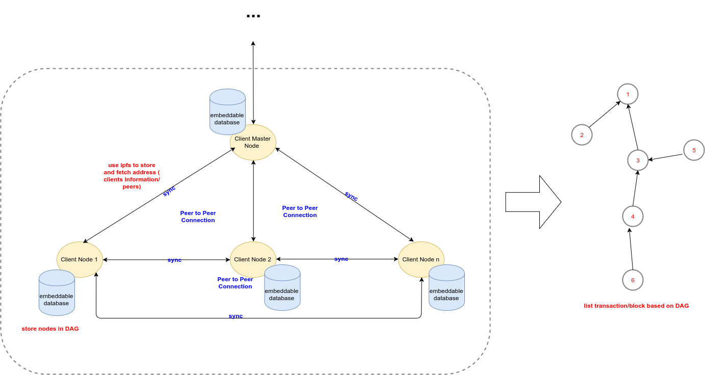

## DAG Block simulation

##### This project is implemented to simulate Directed acyclic graph with store data in database

### Requirement:

- Go >= 1.11

### Setup

##### Local

- Before setup in local, please install go dep `https://github.com/golang/dep`

- Run `dep ensure` to install all packages.

- Use `go run main.go` or `go build `go build -o dag_block && ./dag_block`

##### Docker

- `docker build . -t dag_block`

- `docker run dag_block`

##### Note

this project lend some module from git of `goombaio` (orderedmap, orderedset, dag) with custom code
to support. 